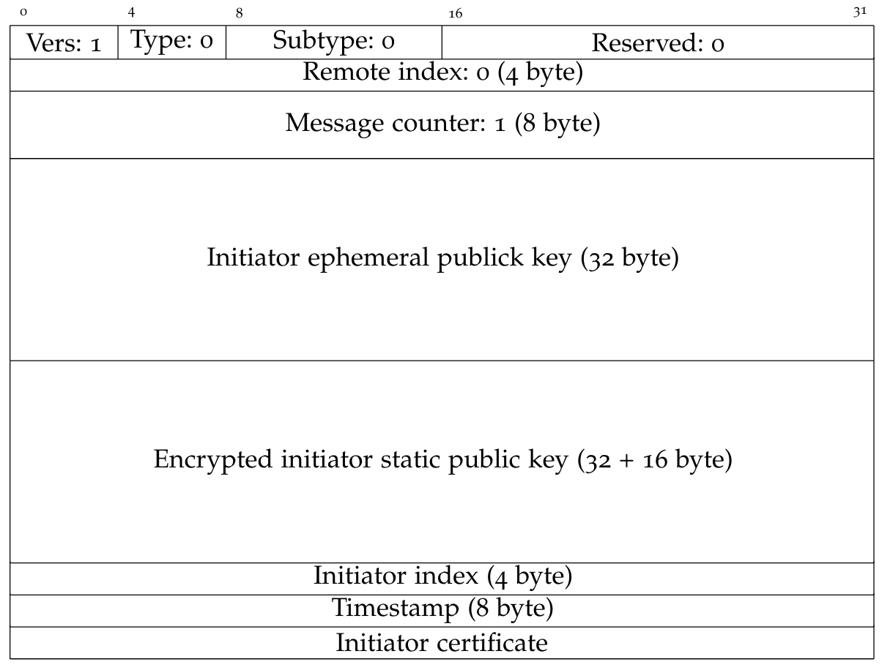
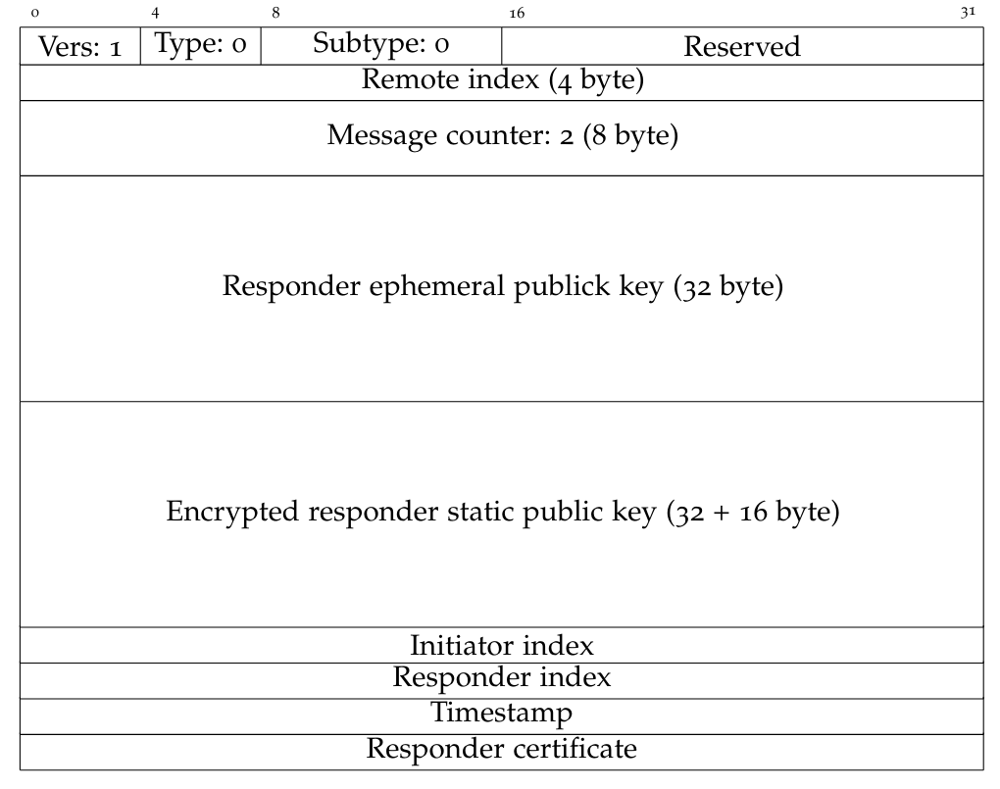

# Nebula VPN protocol

This is a summary in english of my thesis chapter about Nebula, which aims to provide a bit of documentations.

## Handshake

Nebula uses the Noise IXpsk0 as handshake pattern from the *Noise Protocol Framework*, however the psk isn't used yet, leaving the first packet in plaintext.

Leaving out the noise part for now...

The first message is sent from the initiator (a node) to the responder (a node or a lighthouse), and it's structured as follows:

The initiator index is a 32-bit integer randomly generated, the timestamp is unix time.
As of now the last three elements and the static key are not encrypted as the psk is not used in Noise.

The responder receive this message and execute the following actions:
1. Check whether the header structure is valid, then calls the right handshake handler function based on the message counter. This function checks the remote index and if it's zero the Noise parameters for the responder are initialized. [Optionally before this step there are firewalls e/o other controls such as remoteAllow]
1. Process the packet according to the Noise protocol (see Noixe_IXpsk0).
1. Verify the certificate.    

If the connection isn't aborted the responder builds the second message (note that if the initiator cannot be authenticated the resnpoder won't send packets back):

The initiator index value from the first packet is copied into the remote index field into the header, then a responder index is generated and the responder certificate is inserted into the message.
The fields initiator index and timestamp are the same of the first packet.

Receiving this message the initiator:
1. Process everthing according to the Noise protocol.
1. Verify the responder certificate.
